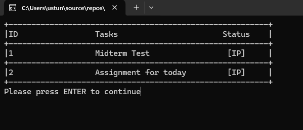

# MySQL-ToDo-App

<h3>ToDo App: </h3>
<b>This application is built in C# programming language to see if I can finish the project challenge in 30 mins.</b>

<h3>Steps Followed:</h3> 
<ol>
  <li>Created Database</li>
  <li>Created Table and Columns</li>
  <li>Designed Management Class Structure</li>
  <li>Started coding accordingly to the design of Management class</li>
</ol>

<b>Since I gave myself limited amount of time such as 30 mins I had to implement most important 2 functions such as Add and Show items in the 'todo' Table as fast as possible.
Thus application might seem it is half completed.</b>

